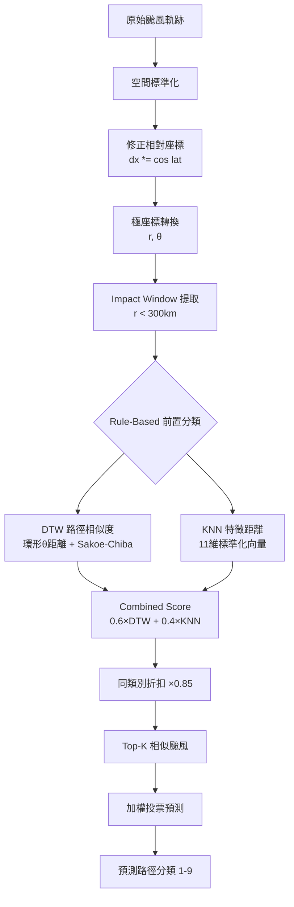

# 類比相似度預測法 (Analog Similarity Method)

基於歷史颱風的多維相似度比對，透過 DTW 路徑對齊 + KNN 特徵距離 + Rule-Based 前置分類，找出最相似的歷史颱風並預測侵臺路徑分類。

## 方法命名

**Analog Similarity Method** — 類比相似度預測法

## 核心理念

> 找的不是「路徑長得像」，而是「對台灣產生類似影響的動態行為」

## 決策流程



## 四層架構

| 層次 | 功能 | 實作 |
|------|------|------|
| 1. 空間標準化 | 解決起點不同問題 | 修正相對座標 + 極座標 |
| 2. 時間對齊 | 解決速度不同問題 | DTW + Sakoe-Chiba band |
| 3. 多維相似度 | 不只比路徑形狀 | 11維特徵 + 路徑序列 |
| 4. 影響導向加權 | 連結到實際災害 | Rain proxy + 距離加權 |

## Step 1: 空間標準化

以台灣為中心 (23.7°N, 121°E)，計算修正相對座標：

```python
# 修正經緯度不等距（關鍵修正）
dx = (lon - 121.0) * cos(lat * π/180)
dy = lat - 23.7

# 極座標
r = haversine(lat, lon, 23.7, 121.0)  # km
θ = atan2(dy, dx)  # radians
```

### 為什麼要修正？
- 1° 經度 ≠ 1° 緯度（隨緯度縮放）
- 台灣附近：lat=111km, lon≈102km（23°N）
- 不修正 → 角度θ會偏斜 → DTW 比較失真

## Step 2: Impact Window (r < 300km)

只取距台灣 300km 內的時間段進行比對：

```python
core_window = r < 300  # 核心影響區
weight = exp(-r / 200)  # 距離加權（越近權重越高）
```

### 為什麼是 300km 而不是 500km？
- 500km 會包含「還沒接近就轉向」的路徑
- 300km 聚焦在實際影響台灣的段落
- 距離加權確保「最接近時刻」的影響最大

## Step 3: DTW 路徑對齊

### 距離函數（多維 + 物理標準化）

```python
d = w1*(Δr/300)² + w2*(Δθ_circular/π)² + w3*(Δwind/100)² + w4*(Δpressure/50)²
```

### 關鍵改進

1. **環形方位角距離**：
   ```python
   Δθ = min(|θ1 - θ2|, 2π - |θ1 - θ2|)
   ```
   解決 179° vs -179° 的問題

2. **物理標準化**：
   - Δr / 300km
   - Δθ / π
   - Δwind / 100kt
   - Δpressure / 50mb

3. **Sakoe-Chiba Band**：
   - 限制時間偏移量（30%）
   - 保留「滯留效應」特徵
   - 防止慢颱風被完全對齊成快颱風

## Step 4: KNN 特徵距離

### 11 維特徵向量

| # | 特徵 | 物理意義 | 放置邏輯 |
|---|------|---------|---------|
| 1 | min_distance_to_taiwan | 接近程度 | KNN only |
| 2 | mean_angle | 通過方位 | KNN only |
| 3 | max_wind_kt | 生命週期強度 | KNN only |
| 4 | max_wind_in_window_kt | 影響時強度 | KNN only |
| 5 | approach_speed_kmh | 接近時速度（r<300km） | KNN only |
| 6 | min_pressure_mb | 最低氣壓 | KNN only |
| 7 | intensification_rate | 增強趨勢 | KNN only |
| 8 | rain_proxy | 降雨潛力 | KNN only |
| 9 | is_landfall | 登陸與否 | KNN only |
| 10 | birth_lon | 生成位置 | KNN only |
| 11 | birth_lat | 生成位置 | KNN only |

### 設計原則：避免 Double Count
- DTW 負責：路徑形狀（r, θ 的時序變化）
- KNN 負責：摘要統計（min_distance, max_wind, speed 等）
- 不把「角度」同時放兩邊

## Step 5: Combined Score

```python
final_distance = 0.6 * DTW_normalized + 0.4 * KNN_normalized

# 同類別折扣（Rule-Based 分類作為 soft filter）
if same_category:
    final_distance *= 0.85
```

## Step 6: Rain Proxy（迎風面修正）

```python
# v2: 含迎風面修正
wind_direction_factor = max(0, cos(θ - θ_taiwan_normal))
rain_proxy = wind * (0.5 + 0.5 * wind_direction_factor) / distance
```

- 台灣迎風面法向量 ≈ 60°（東北風方向）
- 迎風面的颱風降雨潛力更高

## 評估方法

- **Leave-One-Out Cross-Validation**
- 每次取出一筆颱風，用剩餘所有颱風做比對
- 度量：Top-K 中是否包含同分類颱風

## 檔案結構

```
src/similarity/
├── dtw.py          # DTW v2（環形距離 + 物理標準化 + Sakoe-Chiba）
├── knn.py          # KNN（11維特徵 + StandardScaler）
├── combined.py     # Combined v2（Rule-Based soft filter + DTW + KNN）
└── base.py         # 抽象介面

src/features/
└── typhoon.py      # 特徵提取 v2（修正座標 + 300km window + rain proxy v2）
```
