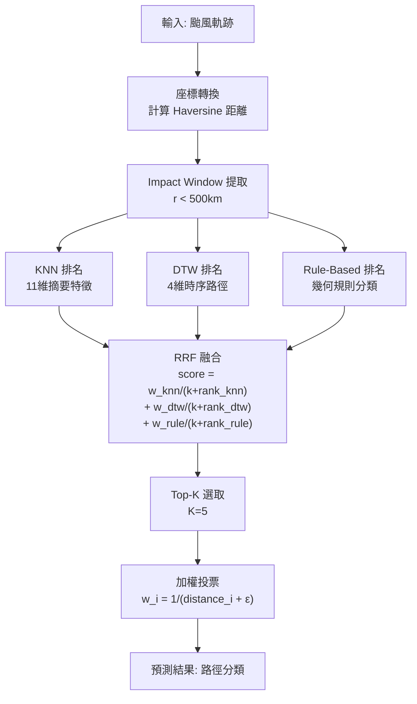

# Combined RRF — KNN + DTW + Rule-Based Reciprocal Rank Fusion

## 概述

Combined RRF 是本系統的主要預測方法，結合三種獨立的排名信號，透過 Reciprocal Rank Fusion (RRF) 融合後進行加權投票預測颱風侵臺路徑分類。

**特點**：三個相似度信號各司其職，RRF 融合避免單一信號的偏見，相比單純機器學習投票方法更穩健。

## 架構流程



## 三組排名信號

### 1. KNN 排名（摘要特徵距離）

從每條軌跡提取 11 維摘要特徵向量：

| 特徵 | 計算方法 | 用途 |
|------|--------|------|
| min_distance | min(Haversine 距離) | 判斷最近點 |
| closest_lat | 最近點的緯度 | 南北位置 |
| closest_lon | 最近點的經度 | 東西位置 |
| approach_heading | 最近點前 3-8 步平均方向 | 接近方向 |
| mean_wind | 路徑平均風速 | 強度 |
| max_wind | 路徑最大風速 | 峰值強度 |
| mean_pressure | 路徑平均氣壓 | 強度 |
| track_length | 路徑總長度 | 活躍範圍 |
| duration_hours | 軌跡持續時間 | 存在時間 |
| speed | 平均移動速度 | 移動快慢 |
| curvature | 路徑曲率 | 路徑彎折度 |

**處理步驟**：
1. StandardScaler 標準化（均值=0，標差=1）
2. 歐式距離計算：$d_{KNN}(q, t) = \sqrt{\sum_i (f_i^q - f_i^t)^2}$
3. 所有颱風排序，得到 $rank_{knn}$

**權重**：$w_{knn} = \alpha = 0.13$

### 2. DTW 排名（時序路徑對齊）

對 500km context window 內的 4 維時間序列做 Dynamic Time Warping：

**序列維度**：
- r：極座標距離（km）
- θ：極座標角度（度）
- wind：風速（kt）
- pressure：氣壓（mb）

**距離計算**：
- **環形角度距離**：$d(\theta_1, \theta_2) = \min(|\theta_1 - \theta_2|, 2\pi - |\theta_1 - \theta_2|)$
- **物理標準化**：$\tilde{s} = [r/300, \theta/\pi, wind/100, pressure/50]$
- **權重向量**：$[1.0, 1.0, 1.0, 0.5]$ 表示 r 和 θ 最重要

**DTW 計算**：
```
局部距離成本矩陣 C[i,j] = 加權歐式距離(q[i], t[j])
全局最小成本：利用 Sakoe-Chiba Band（寬度=30%）限制時間彎曲量
得到 d_DTW(q, t)
```

**權重**：$w_{dtw} = 0.62 = 1 - \alpha - rule\_weight$

### 3. Rule-Based 排名（幾何規則優先度）

使用 CWA 官方分類規則對所有颱風預分類（結果為分類 1-9）。

**排名規則**：
- 與查詢颱風同分類的候選：rank = 0 ~ (N-1)，其中 N = 同分類颱風數
- 不同分類的候選：rank = N ~ M，其中 M = 所有颱風數

**直觀意義**：
- 若查詢颱風被規則分類為「Cat 5」，則所有 Cat 5 颱風會在排名中優先出現
- 這確保 RRF 偏向於路徑型態相同的歷史颱風

**權重**：$w_{rule} = rule\_weight = 0.25$

## RRF 融合公式

三組排名融合為單一 RRF 分數：

$$\text{score}(t) = \frac{w_{knn}}{k + \text{rank}_{knn}(t)} + \frac{w_{dtw}}{k + \text{rank}_{dtw}(t)} + \frac{w_{rule}}{k + \text{rank}_{rule}(t)}$$

其中：
- $k = 60$：RRF smoothing constant（避免排名 0 的分散）
- $w_{knn} + w_{dtw} + w_{rule} = 1$

**具體數值**：
$$\text{score}(t) = \frac{0.13}{60 + \text{rank}_{knn}} + \frac{0.62}{60 + \text{rank}_{dtw}} + \frac{0.25}{60 + \text{rank}_{rule}}$$

## 加權投票預測

1. **Top-K 選取**：根據 RRF 分數降序排列，取前 K=5 筆颱風
2. **距離倒數加權**：$w_i = \frac{1}{d_i + \epsilon}$，其中 $\epsilon = 1e-6$ 避免除以零
3. **多數投票**：$\hat{y} = \arg\max_c \sum_{i=1}^5 w_i \cdot \mathbb{1}(y_i = c)$

## 參數一覽

| 參數 | 值 | 說明 |
|------|-----|------|
| alpha (w_knn) | 0.13 | KNN 特徵權重 |
| rule_weight (w_rule) | 0.25 | Rule-Based 規則權重 |
| w_dtw | 0.62 | DTW 路徑權重 (= 1 - 0.13 - 0.25) |
| rrf_k | 60 | RRF 平滑常數 |
| k (Top-K) | 5 | 最終選取的類比颱風數 |
| pool_size_factor | 10 | 候選池大小 = k × 10 = 50 |
| impact_radius_km | 500 | Context window 半徑 |
| dtw_weights | [1.0, 1.0, 1.0, 0.5] | DTW 各維度權重 [r, θ, wind, pressure] |
| sakoe_chiba_ratio | 0.3 | Sakoe-Chiba Band 寬度比例 |

## 使用方式

```bash
# 使用預設配置
python pipelines/combined_rrf.py

# 指定配置檔
python scripts/run_prediction.py --config configs/experiments/combined_rrf.yaml
```

## 配置檔範例

```yaml
# configs/experiments/combined_rrf.yaml
name: "combined_rrf"
description: "Combined KNN + DTW + Rule-Based similarity using Reciprocal Rank Fusion"
method: "combined"

parameters:
  alpha: 0.13                # KNN 權重
  rule_weight: 0.25         # Rule-Based 權重
  # DTW 權重 = 1 - alpha - rule_weight = 0.62
  k: 5                       # Top-K 類比颱風
  impact_radius_km: 500.0
  pool_size_factor: 10
  rrf_k: 60

  # DTW 參數
  dtw_weights: [1.0, 1.0, 1.0, 0.5]  # [r, θ, wind, pressure]
  sakoe_chiba_ratio: 0.3

  # 特徵標準化
  feature_scaler: "standard"

evaluation:
  metrics: ["category_accuracy"]
  categories: ["1","2","3","4","5","6","7","8","9"]
```

## 評估結果

- **準確率**：71.7% (142/198)
- **評估方式**：Leave-One-Out Cross Validation
- **對象**：分類 1-9（排除分類 0 的 9 筆）

### 分類準確率細節

| 分類 | 正確/總數 | 準確率 |
|------|-----------|--------|
| 1 | 18/23 | 78.3% |
| 2 | 26/29 | 89.7% |
| 3 | 19/30 | 63.3% |
| 4 | 17/21 | 81.0% |
| 5 | 26/30 | 86.7% |
| 6 | 21/30 | 70.0% |
| 7 | 7/11 | 63.6% |
| 8 | 2/6 | 33.3% |
| 9 | 5/18 | 27.8% |

