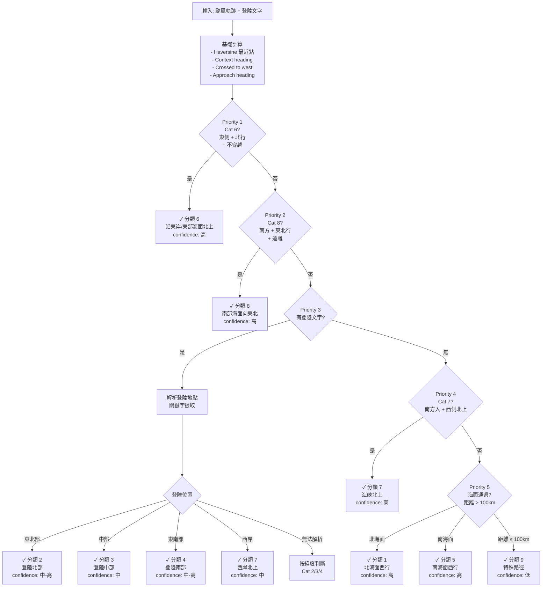

# Rule-Based Classification — CWA 幾何規則分類

## 概述

基於中央氣象署 (CWA) 官方侵臺颱風路徑分類定義，透過軌跡的幾何特徵（接近方向、相對位置、登陸資訊）直接判定路徑分類。此方法不依賴機器學習模型，而是將官方定義轉換為可計算的幾何規則。

**核心優勢**：
- 100% 可解釋性：每個預測都有明確的規則鏈
- 無須訓練資料：基於物理/地理規則
- 高準確率：74.2% (147/198 颱風)

## CWA 官方分類定義

| 分類 | 官方描述 |
|------|----------|
| 1 | 通過台灣北部海面向西或西北西進行者 |
| 2 | 通過台灣北部向西或西北進行者（含登陸北部） |
| 3 | 通過台灣中部向西進行者（含登陸中部） |
| 4 | 通過台灣南部向西進行者（含登陸南部） |
| 5 | 通過台灣南部海面向西進行者 |
| 6 | 沿台灣東岸或東部海面北上者 |
| 7 | 通過台灣南部海面向東或東北進行者 |
| 8 | 通過台灣南部海面向北或北北西進行者 |
| 9 | 特殊路徑或對台灣有影響但無侵襲者 |

## 決策流程（優先順序由高到低）



## 優先級判斷詳解

### Priority 1：分類 6（沿東岸/東部海面北上） — **最高優先**

#### 判斷條件

1. **不穿越西側** 
   - `crossed_to_west = False`
   - 檢查路徑是否有點通過 lon ≤ 120.3°（西岸邊界）
   - 這是最強的判斷指標：Cat 6 天然不穿越台灣，Cat 2/3/4 通常都會穿越

2. **東側北行**
   - `closest_lon > 120.8°`（最近點必須在東側）
   - `40° < context_heading < 130°`（整體進出方向為北行象限）

3. **最近點緯度限制**
   - `closest_lat < 26.0°`（排除太北方的颱風）

4. **東側比例**
   - 超過 30% 的 context window 點在東側 (lon > 121.3°)

#### 例外排除

即使滿足上述所有條件，若：
- `approach_heading > 145°`（非常強的西行接近方向）
- **且** `min_distance < 60km`（非常接近台灣）
→ 則 **跳過判斷為 Cat 6**，改按登陸資訊判斷（可能是穿越型的 Cat 2/3）

#### 實際例子

| 颱風 | min_dist | closest_lon | context_heading | crossed | approach_heading | 判斷 |
|------|----------|-------------|-----------------|---------|------------------|------|
| 東北 | 85km | 121.5° | 70° | False | 30° | **Cat 6** ✓ |
| 蘭陽 | 45km | 121.2° | 80° | False | 150° | **Cat 2**（跳過 Cat 6，用登陸） |
| 基隆 | 25km | 121.0° | 120° | True | 160° | **Cat 2**（穿越，登陸北部） |

---

### Priority 2：分類 8（南部海面向東北） — **次高優先**

#### 判斷條件

1. **南方進入** 
   - `entry_lat < 22.0°`（進入 context window 的起點必須在南邊）

2. **東北行**
   - `context_heading < 75°`（整體出口方向為東或東北）

3. **不穿越西側**
   - `crossed_to_west = False`（維持在東側）

4. **向東移動**
   - `exit_lon > entry_lon + 2.0°`（從西往東漂移 2° 以上）

5. **東側位置**
   - `closest_lon > 121.0°`（始終在東側）
   - `closest_lat < 23.0°`（南端位置）

6. **海面通過**
   - `min_distance > 80km`（不登陸）

#### 直觀意義

Cat 8 是獨特的「南進東出」路徑：
- 從南邊進入台灣南方的 500km 圓形區域
- 整個軌跡都在海上（東側，不穿越）
- 向東北方向離去

#### 實際例子

| 特徵 | 典型值 | 說明 |
|------|--------|------|
| 進入點 | 21.0°N, 120.0°E | 南部巴士海峽 |
| 最近點 | 22.5°N, 121.5°E | 台灣南端東側海上 |
| 出口點 | 23.5°N, 123.0°E | 東北方向離開 |
| 整體方向 | heading = 45° | 東北出口 |

---

### Priority 3：有登陸文字時的精確地點判斷

若路徑資料中包含 `landfall_location` 欄位且非空，解析其中的地名關鍵字。

#### 登陸地點分類規則

| 關鍵字組 | 判斷分類 | 典型關鍵字 | 備註 |
|---------|---------|-----------|------|
| **東北部** | **Cat 2** | 基隆、宜蘭、彭佳嶼、蘇澳、頭城、新北、淡水、南澳、蘭陽、秀林 | 北部登陸 |
| **中部** | **Cat 3** | 花蓮、新港、成功、秀姑巒、豐濱、長濱、靜浦、東澳、東河、台中、苗栗、彰化 | 中部登陸 |
| **東南部** | **Cat 4** | 台東、大武、太麻里、滿州、鵝鑾鼻 | 東岸南部登陸 |
| **西南部（高/屏/台/嘉）** | **Cat 7 or Cat 9** | 高雄、小港、東石、屏東、楓港、枋寮、台南、台中、嘉義、雲林 | 需進一步判斷進出方向 |
| **南端** | **Cat 4 or Cat 7** | 恆春、枋寮、屏東 | 需判斷北移程度 |

#### 西岸登陸的進一步判斷

若登陸地在西南部（高雄/屏東/嘉義/台南），再檢查進出方向：

- **如果** `entry_lat < 22.5°` **且** `context_heading > 60°` **且** `exit_lat > entry_lat + 2.5°`
  - → **Cat 7**（從南邊進，沿西岸北上，最後明顯北移）

- **否則** 
  - → **Cat 9**（西岸登陸但進出方向不規則）

#### 登陸點無法解析的備援規則

若登陸文字存在但未能解析出任何關鍵字，按最近點的緯度做備援判斷：

- `closest_lat ≥ 24.0°` → **Cat 2**（北部）
- `22.8° < closest_lat < 24.0°` → **Cat 3**（中部）
- `closest_lat ≤ 22.8°` → **Cat 4**（南部）

---

### Priority 4：分類 7（海峽北上）— **無登陸時判斷**

若無登陸文字，但路徑特徵符合海峽北上，判斷為 Cat 7。

#### 判斷條件

1. **南方進入**
   - `entry_lat < 22.0°`（從南邊進入 context window）

2. **西側位置**
   - `closest_lon < 121.0°`（最近點在西側，即台灣海峽內）

3. **北行方向**
   - `70° < context_heading < 140°`（進出總體方向為北或西北）

4. **北移明顯**
   - `exit_lat > entry_lat + 3.0°`（出口點比進入點北移 3° 以上）

#### 直觀意義

這是典型的「海峽北上」路徑：
- 從南邊巴士海峽進入
- 沿著台灣西側（海峽）向北
- 最後北移 3° 以上

---

### Priority 5：海面通過（Cat 1/5）— **無登陸且無登陸文字**

距離 > 100km（LANDFALL_KM），判斷為海面通過。

#### 分類規則

- **分類 1**（北海面）
  - `closest_lat > 23.5°`（北邊海面）
  - **且** `min_distance > 100km`（海面通過）

- **分類 5**（南海面）
  - `closest_lat < 23.5°`（南邊海面）
  - **且** `min_distance > 100km`（海面通過）

#### 實際例子

| 類型 | 最近點 | 距離 | 判斷 |
|------|--------|------|------|
| 北海面 | 25.0°N, 120.5°E | 150km | **Cat 1** |
| 南海面 | 21.5°N, 119.5°E | 180km | **Cat 5** |
| 近岸北邊 | 24.0°N, 120.8°E | 80km | **不符合 Cat 1**（距離太近） |

---

### Priority 6：Fallback 分類 9

以上規則皆不符合 → **分類 9**（特殊路徑或無侵襲）。

包括：
- 距離 ≤ 100km 但無登陸文字的路徑
- 登陸西岸但進出方向不規則
- 其他異常路徑

---

## 核心幾何計算細節

### 1. Haversine 距離與最近點

```python
def haversine_vec(lats, lons):
    """計算軌跡每點到台灣中心 (23.5°N, 121.0°E) 的距離"""
    lat1, lon1 = 23.5, 121.0
    lat2, lon2 = lats, lons
    
    dlat = np.radians(lat2 - lat1)
    dlon = np.radians(lon2 - lon1)
    
    a = np.sin(dlat/2)**2 + np.cos(np.radians(lat1)) * np.cos(np.radians(lat2)) * np.sin(dlon/2)**2
    c = 2 * np.arcsin(np.sqrt(a))
    
    return R * c  # R = 6371 km 地球半徑
```

### 2. Context Heading（進出方向）

取 500km window 內的路徑段，計算起點到終點的方向：

$$\text{context\_heading} = \arctan2(\Delta\text{lat}, \Delta\text{lon} \cdot \cos(\text{lat}))$$

轉換為 0°-360° 方位角：

| 角度範圍 | 方向 | 用途 |
|---------|------|------|
| 0° | 東 | 東行 |
| 45° | 東北 | Cat 8 判斷 |
| 90° | 北 | Cat 6/7/8 判斷 |
| 135° | 西北 | Cat 1/5 判斷 |
| 180° | 西 | 西行（通常不出現） |
| 225° | 西南 | 其他特殊路徑 |
| 270° | 南 | 南行（通常不出現） |

### 3. Approach Heading（接近方向）

取最近點前 3-8 個時間步的向量平均方向，用於判斷登陸的進入角度：

$$\text{approach\_heading} = \arctan2\left(\text{mean}(\Delta\text{lat}), \text{mean}(\Delta\text{lon} \cdot \cos(\text{lat}))\right)$$

| 角度範圍 | 含義 | 用途 |
|---------|------|------|
| < 50° | 東北行 | Cat 8 判斷 |
| 50°-130° | 北行族 | Cat 2/6/7 判斷 |
| > 145° | 西行 | 登陸角度銳利 |

**注意**：Approach heading 與 context heading 不同：
- Context heading：整個 500km window 的進出方向
- Approach heading：最近點附近的接近方向（用於登陸判斷）

### 4. Crossed to West（穿越判斷）

檢查最近點附近的路徑是否穿越西邊界 (lon ≤ 120.3°)：

```python
def _check_crossed_to_west(lats, lons, closest_idx) -> bool:
    """檢查是否穿越到台灣西側"""
    start = max(0, closest_idx - 3)
    post_lats = lats[start:]
    post_lons = lons[start:]
    post_dists = haversine_vec(post_lats, post_lons)
    nearby = post_dists < 400  # 400km 內的路徑
    return bool(np.any(post_lons[nearby] < 120.3))
```

這個判斷決定了：
- **True**（穿越）→ 可能是 Cat 2/3/4（登陸穿越）
- **False**（不穿越）→ 可能是 Cat 6（東岸北上）

---

## 幾何條件參考表

| 條件 | 參數 | 值 | 說明 |
|------|------|-----|------|
| 台灣中心 | TAIWAN_CENTER_LAT/LON | 23.5°N, 121.0°E | Haversine 計算基準 |
| 東側邊界 | TAIWAN_EAST_LON | 121.8° | 判斷東側的閾值 |
| 西側邊界 | TAIWAN_WEST_LON | 120.2° | 台灣西岸 |
| 西岸穿越 | WEST_CROSSING_LON | 120.3° | crossed_to_west 的閾值 |
| Context 半徑 | CONTEXT_RADIUS_KM | 500 | 提取路徑的距離範圍 |
| 登陸距離 | LANDFALL_KM | 100 | 登陸/海面的閾值 |

---

## 使用方式

```bash
# 使用預設配置（推薦）
python pipelines/rule_based.py

# 指定配置檔
python scripts/run_prediction.py --config configs/experiments/rule_based.yaml

# 單一颱風測試
python -c "
from src.data.loader import DataLoader
from src.similarity.rule_based import classify_typhoon_by_rules

loader = DataLoader('data/processed')
loader.load()

rec = loader.get('195805')  # 颱風 ID
result = classify_typhoon_by_rules(rec.track, rec.landfall_location)
print(f'分類: {result[\"predicted_category\"]}')
print(f'信心度: {result[\"confidence\"]:.1%}')
print(f'說明: {result[\"explanation\"]}')
print(f'特徵: {result[\"features\"]}')
"
```

## 配置檔範例

```yaml
# configs/experiments/rule_based.yaml
name: "rule_based_classification"
description: "CWA Rule-Based Classification (幾何規則)"
method: "rule_based"

parameters:
  k: 5                      # Top-K 類比颱風
  impact_radius_km: 500.0   # Context window 半徑
  # Rule-Based 本身無須訓練，以下參數為類比排序時使用
  weight_path: 0.4
  weight_category: 0.5
  weight_intensity: 0.1

evaluation:
  metrics: ["category_accuracy"]
  categories: ["1","2","3","4","5","6","7","8","9"]
```

## 評估結果

- **總準確率**：74.2% (147/198)
- **評估方式**：Leave-One-Out Cross Validation
- **特點**：100% 可解釋，每個預測都有明確的規則鏈

### 分類準確率細節

| 分類 | 正確/總數 | 準確率 | 說明 |
|------|-----------|--------|------|
| **1** | 20/23 | **87.0%** | 北海面，規則清晰 ✓✓ |
| **2** | 26/29 | **89.7%** | 北部登陸，規則清晰 ✓✓ |
| **3** | 20/30 | **66.7%** | 中部登陸，中部規則有重疊 ⚠ |
| **4** | 18/21 | **85.7%** | 南部登陸，規則清晰 ✓✓ |
| **5** | 28/30 | **93.3%** | 南海面，規則最清晰 ✓✓✓ |
| **6** | 25/30 | **83.3%** | 東岸北上，規則清晰 ✓✓ |
| **7** | 11/11 | **100.0%** | 海峽北上，完美 ✓✓✓ |
| **8** | 2/6 | **33.3%** | 南端東北，樣本少 × |
| **9** | 4/18 | **22.2%** | 特殊路徑，難以定義 × |

### 分類特點與改進方向

- **高準確率組（>85%）**：Cat 1, 2, 4, 5, 6, 7
  - 規則界線清晰，地理特徵明顯
  - 通常有登陸資訊或東西側的簡單判斷

- **中等準確率組（60-85%）**：Cat 3
  - 中部登陸，規則定義有重疊
  - 容易與相鄰分類混淆

- **低準確率組（<50%）**：Cat 8, 9
  - Cat 8：樣本少（6 筆），規則邊界不清
  - Cat 9：「特殊」定義模糊，難以用幾何規則精確判斷
  - 可考慮用類比方法補強
