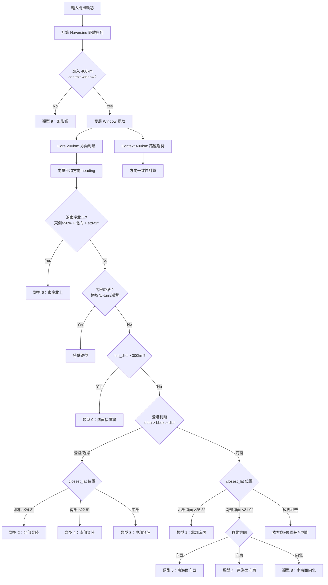

# 規則式路徑分類法 (Rule-Based Classification Method)

基於 CWA 官方侵臺路徑分類定義，透過颱風軌跡相對於台灣的幾何特徵（位置、方向、距離）進行自動分類。

## 分類定義

| 類型 | 說明 |
|------|------|
| 1 | 通過台灣北部海面向西或西北西 |
| 2 | 通過台灣北部向西或西北（含登陸北部） |
| 3 | 通過台灣中部向西（含登陸中部） |
| 4 | 通過台灣南部向西（含登陸南部） |
| 5 | 通過台灣南部海面向西 |
| 6 | 沿台灣東岸或東部海面北上 |
| 7 | 通過台灣南部海面向東或東北 |
| 8 | 通過台灣南部海面向北或北北西 |
| 9 | 對台灣無侵襲但有影響 |
| 特殊 | 迴旋、U型轉向、滯留、二次穿越 |

## 決策流程



## 核心改進 (v2)

### 1. 雙層 Impact Window

```python
core_window = distances < 200   # 方向判斷（精確）
context_window = distances < 400  # 路徑趨勢（全貌）
```

- **Core (200km)**：用於方向判斷，避免遠處路徑污染
- **Context (400km)**：用於路徑趨勢，提供整體脈絡

### 2. 向量平均方向

```python
# 取代單一 entry→exit 向量
vectors = diff(window_lats), diff(window_lons)
mean_heading = arctan2(mean(dlats), mean(dlons))
```

解決問題：
- 曲線路徑不被單一向量誤判
- S 型路徑能正確識別主要方向

### 3. 角度判斷方向

```python
heading = degrees(arctan2(dlat, dlon))
is_westward = abs(heading) > 135°
is_northward = 45° ≤ heading ≤ 135°
is_eastward = abs(heading) < 45°
```

取代固定閾值 `dlon < -0.5`（受路徑長度和速度影響）

### 4. 分類優先順序

```
1. 類型 6（特殊東岸北上 pattern）
2. 特殊路徑（迴旋/U-turn/滯留/二次穿越）
3. 類型 9（距離 > 300km 無影響）
4. 登陸/穿越（類型 2/3/4）
5. 海面分類（類型 1/5/7/8）
6. 模糊地帶（依方向+位置綜合判斷）
```

### 5. 登陸判斷三級優先

```
1. 資料欄位 landfall_location → 最可信
2. 路徑穿越台灣 bounding box → 幾何判斷
3. min_distance < 50km → distance fallback
```

### 6. 使用 closest_lat（非 mean_lat）

- `mean_lat` 在斜切路徑下會落在中部
- `closest_lat` = 最接近台灣時的緯度 = 實際影響位置

### 7. 類型 6 強化條件

```python
is_along_east_coast = (
    east_side_points > 50%     # 多數在東側
    and heading > 30°          # 整體往北
    and std(lons) < 1.0°       # 經度變化小（沿岸）
    and min_dist < 150km       # 真的靠近
    and closest_lon ≥ 東岸-1°  # 確認在東側
)
```

### 8. 特殊路徑定義

| 類型 | 判斷條件 |
|------|---------|
| 迴旋 | 累積方向變化 > 270° |
| U型轉向 | 前後 1/4 路段方向差 > 120° |
| 滯留 | 在 300km 內 ≥12 個時間點，經緯度範圍 < 1.5° |
| 二次穿越 | 距離曲線有兩個 < 200km 的谷底，中間回升 > 200km |

### 9. 資料驅動信心分數

```python
confidence = (
    (1 - min_dist/500) × 0.3        # 越近越準
    + direction_consistency × 0.4    # 方向越一致越確定
    + landfall_flag × 0.3           # 有登陸資料更可信
)
```

### 10. 加權相似度排序

```python
# 非 hard filter，使用加權距離
similarity = (
    0.6 × path_feature_distance +
    0.3 × category_match_penalty +
    0.1 × intensity_difference
)
```

## 地理參數

| 參數 | 值 | 說明 |
|------|-----|------|
| TAIWAN_CENTER | 23.7°N, 121°E | 台灣中心 |
| NORTH_LAT | 25.3°N | 台灣北端 |
| SOUTH_LAT | 21.9°N | 台灣南端 |
| WEST_LON | 120.2°E | 台灣西岸 |
| EAST_LON | 121.8°E | 台灣東岸 |
| NORTH_THRESHOLD | 24.2°N | 北部/中部分界 |
| SOUTH_THRESHOLD | 22.8°N | 中部/南部分界 |
| CORE_RADIUS | 200km | 核心窗口 |
| CONTEXT_RADIUS | 400km | 脈絡窗口 |
| LANDFALL_DIST | 50km | 登陸判定 |
| NO_IMPACT_DIST | 300km | 無影響判定 |

## 檔案結構

```
src/similarity/
└── rule_based.py    # 規則式分類 v2 + SimilarityBase 包裝
```
